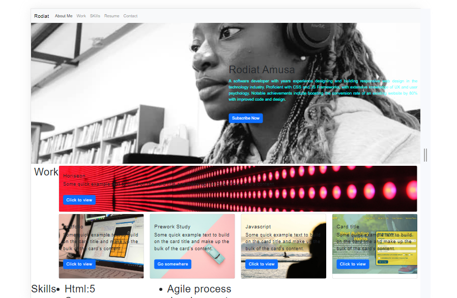
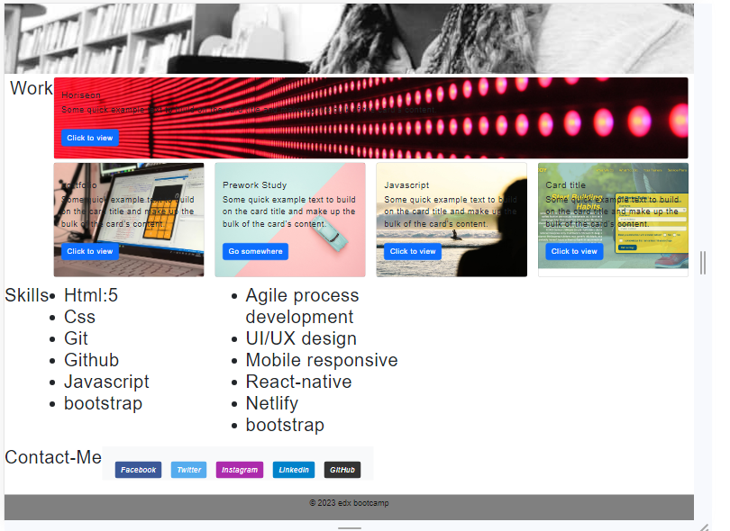

# bootstrap-Portfolio
A portfolio built with bootstrap

## Description
A showcase of projects, with past tech stacks, case studies, and  work history. It's the cumulation of all the different experiences and  tips  gathered over the years.Witht the use of boostrap cards and other bootstrap properties such as jumbotron,card. to achieve mobile view,with regards to mobile  responsiveness.

## Installation
N/A

## Usage
A portfolio project used in display projects that were build and helps in displaying the soft skills set acquired and different 

## Credit
https://developer.mozilla.org/

https://www.w3schools.com/

https://stackoverflow.com/

https://css-tricks.com/

## Built with
HTML5 CSS BOOTSTRAP

## License
N/A

## 
## 

